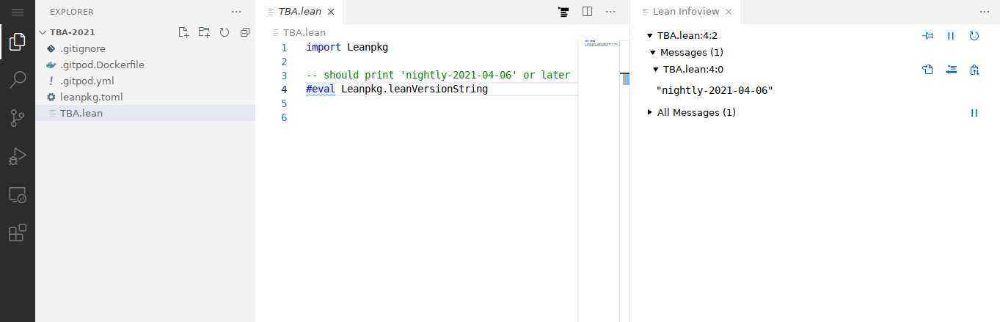

# tba-2021
Slides and exercises of the [Lean 4](https://leanprover.github.io/lean4/doc/) course [Theorem prover lab: applications in programming languages](https://pp.ipd.kit.edu/lehre/SS2021/tba/) at the Karlsruhe Institute of Technology, Summer 2021.

## Setup

You can run and edit the Lean files in this repository either locally on your machine or using [gitpod.io](https://gitpod.io/) right in your browser.
You can run Gitpod workspaces for free for 50 hours per month, which should be more than sufficient for the course, but you can switch to a local installation at any point.

### Gitpod

1. Register at https://gitpod.io/login/
1. Go to https://gitpod.io/#/https://github.com/IPDSnelting/tba-2021/ to spawn a new workspace based on this repository.
Whenever you click on that link again, you should get a fresh copy of the newest commit of the repository.
Go to https://gitpod.io/workspaces/ instead to continue working on an existing workspace with your changes.
1. When the workspace has finished loading, you should get a VS Code interface. Open the file `TBA.lean` to verify the setup.
1. After a few more seconds, you should get a syntax-highlighted file with a "Lean Infoview" on the right that tells you the installed Lean version when placing your cursor on the last line. 
1. Don't forget to stop the workspace when you are done: press F1 and select "Gitpod: Stop Workspace".
The workspace *should* stop automatically 30min after the last interaction or 3min after closing the tab, but sometimes it doesn't seem to.

### Local Setup

1. Follow the [quickstart](https://leanprover.github.io/lean4/doc/quickstart.html) instructions up to creating the test file.
1. Download this repository, either using `git clone` or the "Download ZIP" option on the green "Code" button above.
1. Use "File > Open Folder..." to open the repository in VS Code.
1. Open the file `TBA.lean` to verify the setup. You should get a syntax-highlighted file with a "Lean Infoview" on the right that tells you the installed Lean version when placing your cursor on the last line (see screenshot above).
